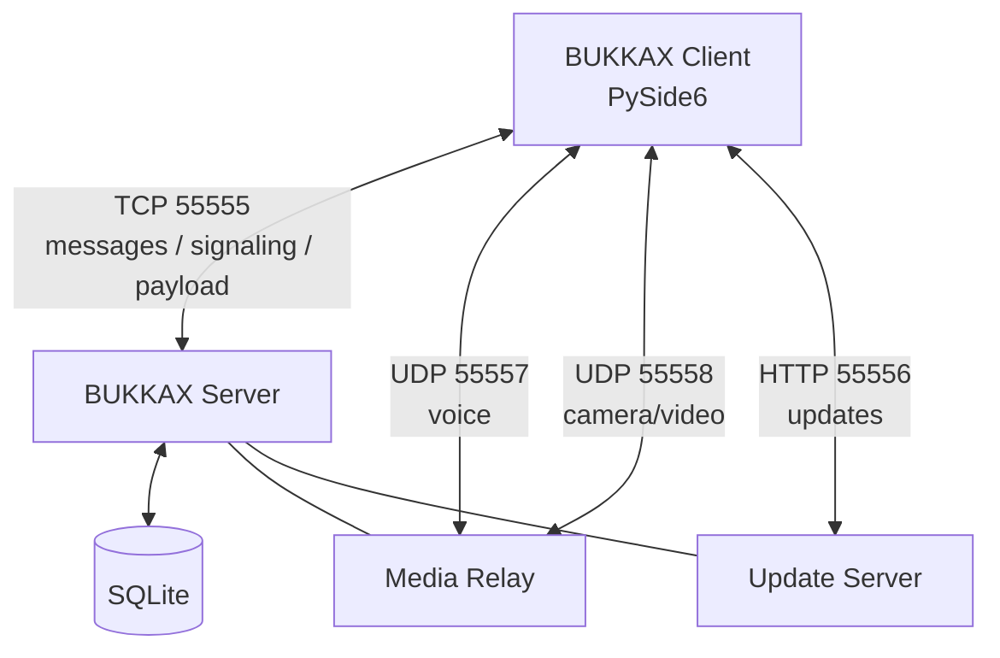

<div align="center">

# BUKKAX

### Desktop-мессенджер на Python / PySide6

Чаты • звонки • демонстрация экрана • шахматы • музыка • Developer Studio


**BUKKAX** — экспериментальный desktop-мессенджер с собственным клиентом, сервером и сетевым протоколом.

</div>

---

## 📸 Интерфейс

> README ожидает эти имена файлов. Если твои скриншоты называются иначе — просто переименуй их или поменяй пути ниже.

<table>
<tr>
<td width="50%">

**Главное окно**


</td>
<td width="50%">

**Шахматы**


</td>
</tr>
<tr>
<td width="50%">

**Developer Studio**


</td>
<td width="50%">

**Звонки / Screen Share**


</td>
</tr>
</table>

---

## ✨ Возможности

| Раздел | Возможности |
|---|---|
| 💬 Общение | общий чат, личные сообщения, список друзей |
| 📎 Файлы | отправка файлов и изображений, вставка из буфера обмена |
| 👤 Профили | аватары, просмотр профиля, подарки |
| 📰 Новости | пользовательская лента новостей |
| 📞 Звонки | голосовые и видеозвонки |
| 🖥 Screen Share | демонстрация экрана или окна приложения |
| ♟ Шахматы | PvP, локальный бот, история ходов, дебюты, случайные цвета |
| 🔊 Chess FX | звуки ходов, шаха и визуальная подсветка |
| 🎵 Музыка | отдельное музыкальное окно |
| 🔄 Обновления | встроенная система обновления клиента |
| 🛠 Developer Studio | визуальный конструктор интерфейса и локальные dev-действия |

---

## 🛠 Developer Studio

BUKKAX включает собственный визуальный конструктор интерфейса.

Можно:

- создавать кнопки, поля, текст и изображения;
- свободно располагать элементы;
- менять `X / Y / Width / Height`;
- менять скругление, размер текста и цвета;
- загружать иконки;
- выбирать видимость:
  - всем пользователям;
  - только администратору;
  - только разработчику;
- привязывать встроенные действия BUKKAX;
- локально запускать Python-код, `.py`, программы, файлы и папки.

> **Важно:** произвольный Python-код, EXE и локальные пути не публикуются другим пользователям. Они остаются локальными developer-actions.

---

## 🧱 Архитектура



Основные компоненты:

```text
client_qt.py
    ├── GUI
    ├── chat / DM
    ├── profiles
    ├── calls
    ├── files
    └── updater

server.py
    ├── authorization
    ├── routing
    ├── SQLite
    ├── call signaling
    ├── media relay
    └── update HTTP

protocol.py
    └── TCP framing

bukkax_chess_qt.py
    └── chess engine + UI

bukkax_dev_builder.py
    └── Developer Studio

bukkax_builder_sync.py
    └── Builder synchronization

bukkax_screen_share.py
    └── screen / window sharing

bukkax_call_quality.py
    └── voice buffering / call improvements

music_player.py
    └── music window
```

---

## 📡 Протокол

Основной TCP framing:

```text
┌──────────────────────┐
│ 4 bytes header size  │
├──────────────────────┤
│ JSON header          │
├──────────────────────┤
│ optional payload     │
└──────────────────────┘
```

Если в header присутствует размер бинарного payload, клиент или сервер дочитывает ровно указанное количество байт.

### Порты

| Порт | Протокол | Назначение |
|---:|---|---|
| `55555` | TCP | чат, команды, signaling, payload |
| `55556` | HTTP/TCP | автообновление |
| `55557` | UDP | голос |
| `55558` | UDP | видео |

---

## 🚀 Запуск из исходников

### Требования

- Windows 10/11
- Python 3.11+
- PySide6

Создай виртуальное окружение:

```powershell
python -m venv .venv
.\.venv\Scripts\Activate.ps1
```

Установи зависимости:

```powershell
python -m pip install --upgrade pip
pip install -r requirements.txt
```

### Сервер

```powershell
python server.py
```

### Клиент

Для локального сервера:

```powershell
$env:BUKKAX_SERVER_IP="127.0.0.1"
python client_qt.py
```

Для удалённого сервера укажи его адрес через `BUKKAX_SERVER_IP`.

---

## 📦 Сборка EXE

Установи PyInstaller:

```powershell
pip install -r requirements-dev.txt
```

### Клиент

```powershell
.\scripts\build_client.ps1
```

Результат:

```text
dist\Bukkax.exe
```

### Сервер

```powershell
.\scripts\build_server.ps1
```

Результат:

```text
dist\server.exe
```

---

## 🔄 Автообновление

На production-сервере update-каталог выглядит примерно так:

```text
updates/
├── version.txt
└── Bukkax.exe
```

`updates/` не должен храниться в публичном GitHub-репозитории.

---

## ♟ Шахматы

Шахматный модуль включает:

- проверку легальных ходов;
- шах / мат / пат;
- рокировку;
- превращение пешки;
- автоматический разворот доски за чёрных;
- координаты `a-h / 1-8`;
- случайный выбор цвета в PvP;
- локального бота;
- историю ходов;
- определение некоторых дебютов;
- звуки ходов и шаха;
- визуальное выделение короля под шахом.

---

## 🔐 Безопасность репозитория

Перед каждым публичным релизом:

```powershell
python scripts\prepublish_check.py .
```

Не публикуй:

```text
chat_users.db
*.db
*.sqlite
.env
web_profile/
updates/
*.bak*
client_crash.txt
cookies / sessions
API keys / tokens / passwords
```

Также не стоит добавлять аудио и изображения, если у тебя нет права на их распространение.

Подробнее: [`SECURITY.md`](SECURITY.md)

---

## 📚 Документация

| Документ | Описание |
|---|---|
| [`docs/ARCHITECTURE.md`](docs/ARCHITECTURE.md) | архитектура проекта |
| [`docs/BUILD.md`](docs/BUILD.md) | запуск и сборка |
| [`docs/FULL_CODE_GUIDE.md`](docs/FULL_CODE_GUIDE.md) | большой разбор кода |
| [`docs/PUBLISH_CHECKLIST.md`](docs/PUBLISH_CHECKLIST.md) | проверка перед Public |
| [`docs/FIRST_GITHUB_PUSH.md`](docs/FIRST_GITHUB_PUSH.md) | первый push |

---

## 🗺 Roadmap

- [ ] дальнейшее улучшение качества международных звонков;
- [ ] более современный аудиокодек;
- [ ] развитие Screen Share;
- [ ] расширение Developer Studio;
- [ ] больше визуальных компонентов Builder;
- [ ] улучшение шахматного модуля;
- [ ] рефакторинг большого `client_qt.py` на отдельные компоненты;
- [ ] автоматические тесты protocol/server;
- [ ] нормальная система версий и Releases.

---

## 🧪 Статус проекта

BUKKAX находится в стадии **Alpha**.

Проект активно развивается, архитектура и сетевые механизмы могут меняться.

Это одновременно:

- рабочий экспериментальный мессенджер;
- учебный проект по Python;
- практика PySide6;
- практика client/server networking;
- площадка для экспериментов с desktop UI.

---

## 🤝 Contributing

Перед commit:

```powershell
python -m compileall -q .
python scripts\prepublish_check.py .
```

Подробнее: [`CONTRIBUTING.md`](CONTRIBUTING.md)

---

## 📄 License

Open-source лицензия пока не выбрана.

См. [`LICENSE_NOT_SELECTED.md`](LICENSE_NOT_SELECTED.md).

---

<div align="center">

### BUKKAX

Built with **Python + PySide6**

</div>
